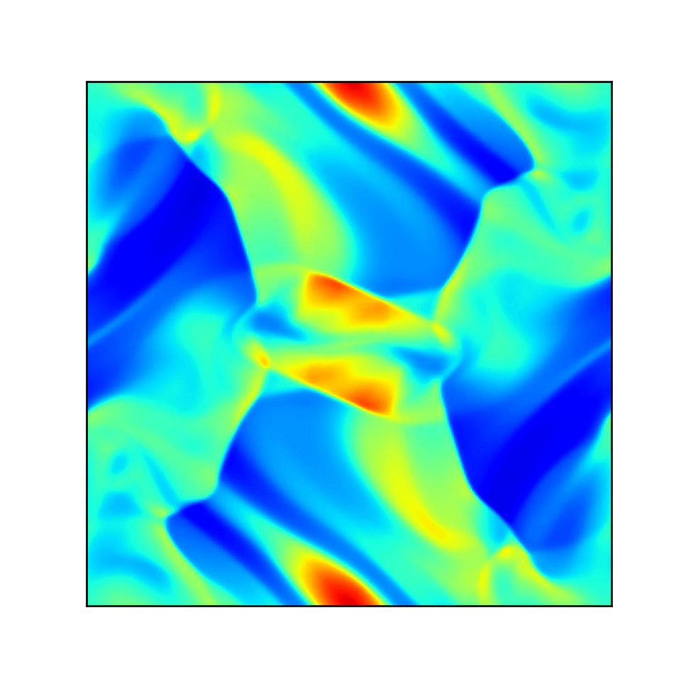

# constrainedtransport-python
Finite Volume Constrained Transport simulation of the Orszag-Tang vortex

## Create Your Own Constrained Transport Magnetohydrodynamics Simulation (With Python)

### Philip Mocz (2023), [@PMocz](https://twitter.com/PMocz)

### 📝 [Read the Algorithm Write-up on Medium.com](https://levelup.gitconnected.com/create-your-own-constrained-transport-magnetohydrodynamics-simulation-with-python-276f787f537d)

Simulate the Orszag-Tang vortex MHD problem


```
python constrainedtransport.py
```


